# geo2d — seeded generator of 2D "generic mechanical part" domains

Pure Python (numpy + matplotlib). Produces planar domains made of straight
edges, circular arcs and cubic spline edges that look like the test shapes in
quad-meshing papers, with guaranteed validity and a bounded feature-size ratio,
so they can be meshed with a reasonably coarse uniform quad mesh. Airfoils and
fluid domains are built from the same format, and a small coordinate-only API
puts mesh nodes onto the curved edges.

```python
from geogen import geo2d
g = geo2d.generate(seed=7)                 # default preset, ratio 10
geo2d.plot_geometry(g)                     # draws into the current figure (cleared first)
```

Tests: `python -m pytest geogen/geo2d/tests` (the Gmsh test is skipped if `gmsh` is not on the path).
The figures below are produced by `python geogen/geo2d/examples/make_examples.py`.

## 1. Generating shapes

`generate(seed, params=None, preset=None, **overrides)` returns one valid
`Geometry`; `generate_many(seed, n, ...)` returns a list with derived seeds.
Parameters come from a preset, then keyword overrides, then defaults.

### Complexity ladder

```python
geo2d.generate_many(1, 6, preset="simple")    # ratio 8, 1-2 boundary ops, up to 1 hole
geo2d.generate_many(1, 6, preset="medium")    # ratio 12, 3-5 ops, 2-4 modifiers, 1-3 holes
geo2d.generate_many(1, 6, preset="complex")   # ratio 20, 5-9 ops, 4-8 modifiers, 2-5 holes, notches/bulges, combs
```

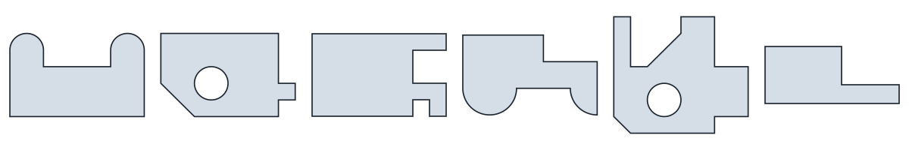
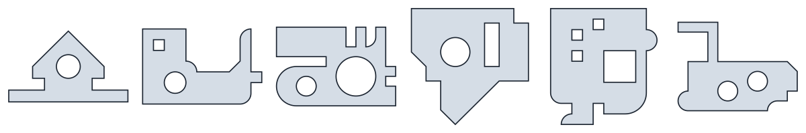
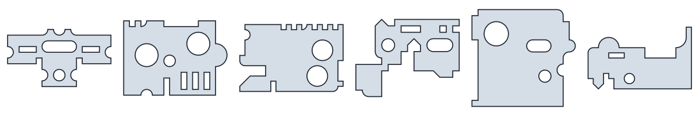

### Straight lines only

```python
geo2d.generate_many(2, 6, preset="straight")   # 45 and 90 degrees, no arcs; holes are rectangles and diamonds
geo2d.generate_many(2, 6, preset="polycube")   # 90 degrees only, rectangular holes only
```

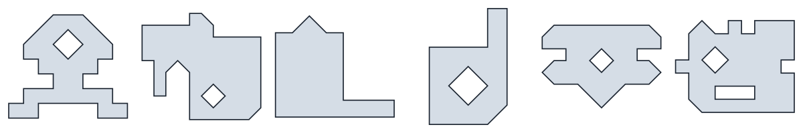
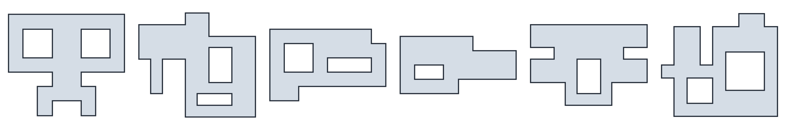

### Individual parameters

```python
geo2d.generate_many(3, 6, symmetry="x")                                   # always mirror-symmetric about the vertical axis
geo2d.generate_many(4, 6, arcs="all", n_mods=(3, 6))                      # also semicircular notches and bulges
geo2d.generate_many(5, 6, n_holes=(2, 4), n_ops=(1, 3),
                    hole_types={"circle": 0.5, "slot": 0.5})              # hole-dominated plates
geo2d.generate_many(6, 6, ratio=20, aspect=(1.5, 2.5), n_ops=(4, 8),
                    n_mods=(3, 6), n_holes=(1, 4))                        # larger, elongated, finer features
geo2d.generate_many(7, 6, preset="star")                                  # 45-degree corners allowed everywhere
geo2d.generate_many(8, 6, preset="comb")                                  # combs of unit slots (deliberately small features)
```

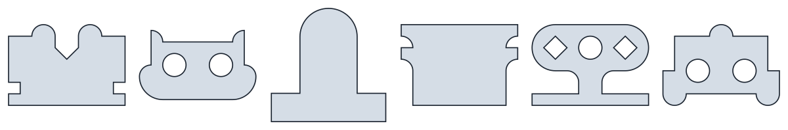
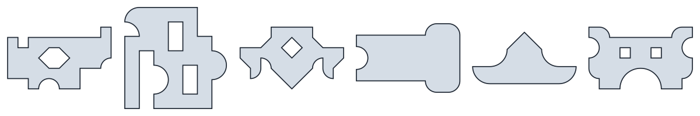
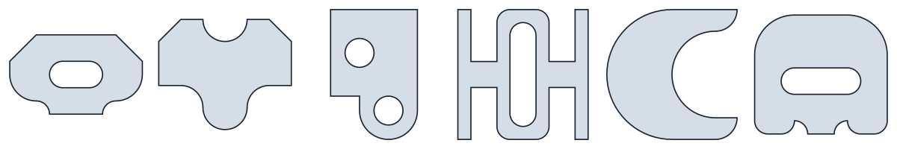
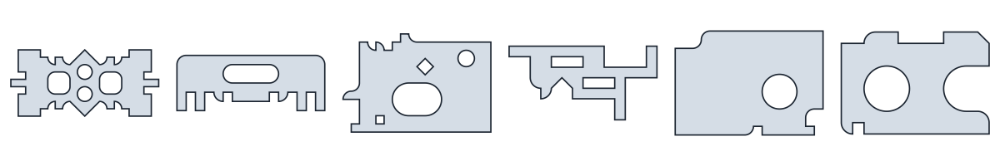
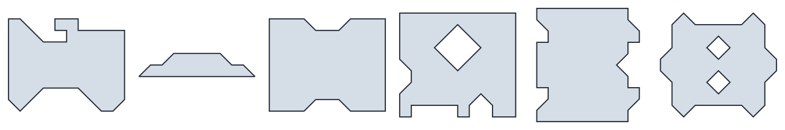
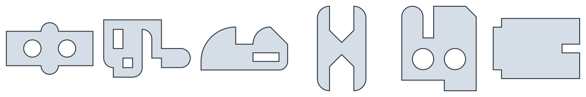

The same seed under different parameters (the random stream is shared, so
early decisions such as the base rectangle often coincide):

```python
for kw in [dict(), dict(angles=(90,)), dict(arcs="none"), dict(symmetry="xy"), dict(n_holes=(3, 3))]:
    geo2d.generate(21, **kw)
```

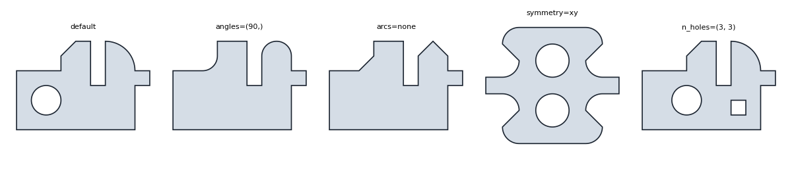

### Parameter table (`geo2d.Params`)

| name | meaning | default |
|---|---|---|
| `ratio` | lattice size = largest bbox side / smallest feature; every feature is ≥ 1 unit | 10 |
| `aspect` | bbox aspect ratio, fixed or (lo, hi) range | (1.0, 1.6) |
| `n_ops` | raster boundary operations: rectangle cuts, additions, combs | (2, 5) |
| `n_mods` | corner/edge modifiers: chamfer, fillet, paired ends, semicircular notch/bulge | (1, 4) |
| `n_holes` | interior features to attempt (a pattern or mirrored pair counts once; placement may fail on small shapes) | (0, 3) |
| `angles` | `(90,)` or `(45, 90)`: enables chamfers, tapers, diamonds, 45° tips | (45, 90) |
| `arcs` | `"none"`, `"fillets"`, `"all"` (adds semicircular notches and bulges) | `"fillets"` |
| `symmetry` | probability of a mirror-symmetric shape, or `"none"`, `"x"`, `"y"`, `"xy"` | 0.5 |
| `patterns` | linear arrays of holes | True |
| `acute` | probability that a chamfer may create a 45-degree corner | 0.2 |
| `comb` | probability that a boundary op is a comb of unit slots | 0.1 |
| `hole_types` | weights for `circle` / `slot` / `rect` holes | 0.6 / 0.25 / 0.15 |
| `hole_radius` | range of hole radii in lattice units | (1, 2) |

Integer parameters accept a fixed value or a `(lo, hi)` range sampled per shape.
Presets (`geo2d.PRESETS`): `default`, `simple`, `medium`, `complex`, `straight`, `polycube`,
`plain`, `chamfered`, `rounded`, `holey`, `comb`, `star`, `fine`. A `Params` object can be built
and edited directly: `P = geo2d.Params(ratio=16).replace(n_holes=(1, 2))`.

## 2. Plotting

`plot_geometry(g, ax=None, ...)` draws into the current figure after clearing it
(MATLAB style: repeated calls reuse the window); pass `ax=` to draw somewhere
else or `clear=False` to keep what is there. `plot_gallery(geoms, ncols=6, ...)`
fills the current figure with a grid of thumbnails and forwards extra keyword
arguments to `plot_geometry`.

```python
geo2d.plot_geometry(g)                                   # filled shape, smooth arcs
geo2d.plot_geometry(g, show_points=True, show_chords=True)   # control points and the chord polygon
geo2d.plot_geometry(g, show_tags=True, fill=False)       # edges coloured by feature (chamfer, fillet, hole, ...)
geo2d.plot_geometry(g, show_angles=True)                 # interior angle of the domain at every vertex
geo2d.plot_gallery(geo2d.generate_many(0, 24), ncols=6, titles=range(24))
```

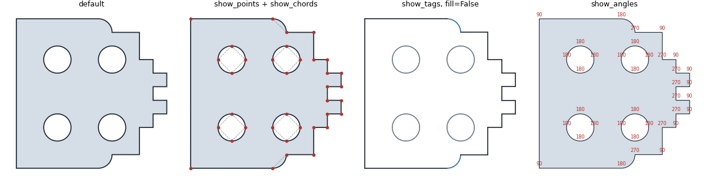

## 3. Interior angles for the mesh generator

`g.vertex_angles()` returns, per loop, the angle of the domain at every vertex
in degrees, computed from the edge tangents so arcs are respected: a circle
gives 180 at all four control points (a smooth joint), a rectangular hole gives
270 at its corners (the angle outside the hole), a slot gives 180 everywhere
because its arcs are tangent to its straight edges. The same numbers are
written as `vertex_angles` in the JSON (derived, recomputed on load) and as
`// angle` comments on the `Point` lines of the Gmsh script.

```python
for angles in g.vertex_angles():
    print(angles)                                   # e.g. [ 90. 135.  90. 180. 180. 270. ...]
geo2d.describe(g)["interior_angles"]                # histogram, keys "45" ... "315", "180" = smooth
```

## 4. Curved edges for the mesh generator

Every edge has an evaluator (`geom.edge(li, ei)`; classes `Line`, `Arc`,
`Spline` in `curves.py`) with a parameter `t` in [0, 1] proportional to arc
length: `point(t)`, `tangent(t)`, `curvature(t)`, `length`. `geom.normal(li, ei, t)`
points into the material. A mesher can use these directly, but it does not have
to track parameters at all:

```python
M = geom.split(A, B)             # point halfway (by arc length) between boundary nodes A and B,
M = geom.split(A, B, s=0.3)      # on the edge that contains both; straight edges give the linear interpolant
pts = geom.snap_chain(chain)     # ordered boundary chain; interior points moved onto the edge,
                                 # chord-length fractions become arc-length fractions (no iteration)
nodes, chains = geom.snap_mesh(nodes, elements)   # every boundary chain of a mesh, topologically found;
                                                  # chains = [(loop, edge, [node ids from start to end]), ...]
geom.locate(p)                   # [(loop, edge, t)] for a point on the boundary (two entries at a control point)
geom.project(p)                  # nearest boundary point (loop, edge, t, q), diagnostics only
```

`split` is the primary interface: when a mesher splits a boundary edge it knows
the two end nodes, so nothing else is needed, every new node is exactly on the
curve, and it is incremental. `snap_mesh` is for meshers that produce a whole
mesh at once; it requires all control points to be mesh nodes (matched within a
tolerance, default 1e-9 of the bounding box). Given a `Mesh` it returns a `Mesh`
whose `data["bnd_loop"]`, `data["bnd_edge"]`, `data["bnd_t"]` record, for every
boundary node, the geometry edge and arc-length parameter it sits on.

## 5. Meshes, quality and smoothing

`Mesh(nodes, elements)` is a minimal container for mixed elements including
arbitrary polygons: ragged input, stored as flat connectivity plus offsets.
Elements are re-oriented counter-clockwise on construction.

```python
m = geo2d.Mesh(nodes, [[0, 1, 2, 3], [1, 4, 2], [3, 2, 5, 6, 7]])   # quad, triangle, pentagon
m.quality()            # per element: min corner quality, 1 regular, 0 degenerate, < 0 inverted
m.inverted()           # ids of inverted or non-convex elements
m.edges(); m.boundary_edges(); m.boundary_nodes(); m.degrees(); m.node_angles()
m.by_size()            # {3: (ids, (M3, 3) conn), 4: ..., 5: ...} for vectorised per-type work
m.irregular_nodes()    # (ids, actual degree, desired degree) from the target-angle heuristic
m.save("m.json"); geo2d.Mesh.load("m.json"); m.write_msh("m.msh"); m.write_vtk("m.vtk")
mesh = geo2d.gmsh_mesh(g, lc=1.0, quads=True, exact=True)   # run the Gmsh binary, read the mesh back
```

Quality is corner based so one definition covers every element type: at a
corner with edge vectors a and b, `2 (a x b) / (|a|^2 + |b|^2)` divided by the
sine of the regular n-gon angle. Mean-ratio metrics for triangles and quads
can be added later. The desired degree of a node is `360/alpha` inside and
`round(theta/alpha) + 1` on the boundary, theta being the domain angle at the
node and alpha the target element angle (deduced from the dominant element
type: 90 for quads, 60 for triangles); `plot_mesh(m, irregular=True)` marks
nodes above target in red and below in blue.

Smoothers keep the boundary fixed (any node mask can be frozen with `fixed=`)
and return a new mesh:

```python
geo2d.laplacian(m, iters=20)          # edge-based Laplacian
geo2d.smart_laplacian(m)              # accepts a move only if the local minimum quality does not drop
geo2d.optimize(m, iters=5)            # per-node untangling + condition-number smoothing (Newton)
geo2d.plot_mesh(m, geom=g, color="quality", colorbar=True, irregular=True)
```

Below, Gmsh meshed the chord polygon of a shape, `snap_mesh` moved the boundary
nodes onto the arcs (which inverted two elements), and `optimize` untangled and
smoothed the result with the boundary frozen.

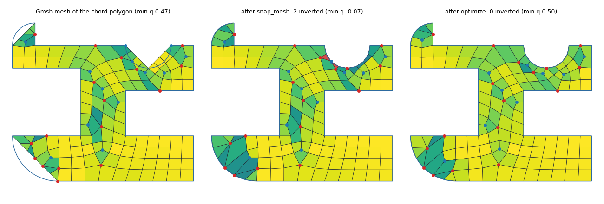
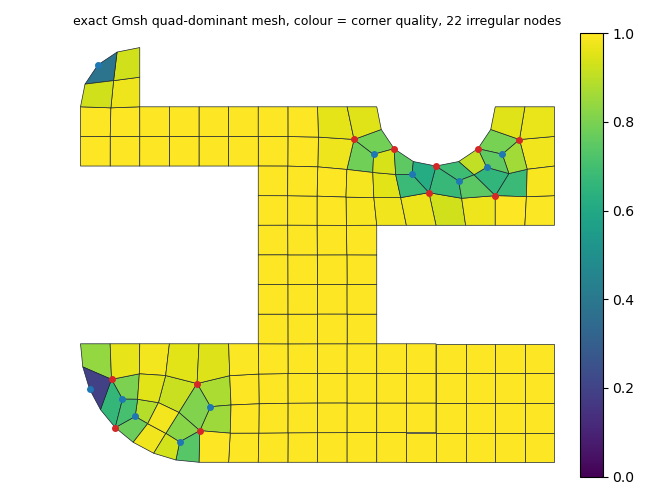

## 6. Internal boundaries and regions

Internal curves (`Chain`s, open curves made of the same edge types as loops)
split the domain into regions. Every loop edge carries the region on its
material side (`region`, default 0) and every chain the pair
`regions = (left, right)`. Labels are never typed by hand: `label_regions`
traces the faces of the planar graph formed by loops and chains, numbers the
material faces 0, 1, ... by position and writes the labels; `validate` checks
conformity (chain ends coincide with vertices or lie inside the material),
that chains cross nothing, and that the labels match the traced faces. A
single cut through a ring is a chain with the same region on both sides; the
region stays one piece.

```python
g = geo2d.Geometry([geo2d.rect_loop(0, 0, 10, 6), geo2d.rect_loop(3, 2, 5, 4, hole=True)])
one = g.cut((4, 0), (4, 2))         # straight cut from the bottom edge to the hole: one region, chain (0, 0)
two = one.cut((4, 4), (4, 6))       # second cut: regions 0 and 1, both chains (0, 1)
arc = disc.cut((-4, 0), (4, 0), angle=90)    # a circular-arc cut
cl = shape.cut_line(0, 4)           # cut along the whole lattice line x = 4 (one chain per material segment)
two.regions(); two.chains[0].regions
sub = two.region_geometry(1)        # region 1 as a plain Geometry (outer loop, holes, and its own internal chains)
```

`cut` attaches the end points to the boundary or to existing chains, splitting
the edge they land on (lines and arcs; for spline edges cut at a control
point), and rejects cuts that end outside the material or cross anything.
`region_geometry(r)` returns a region with simple loops; a cut with the region
on both sides and dangling chains come back as internal chains of the result,
so every region is directly meshable. `plot_geometry(g, color_regions=True)`
colours the regions and draws chains in red. Gmsh export writes one plane
surface per region sharing the internal curves (conforming mesh), embedding
a curve that has the same region on both sides; `gmsh_mesh` returns the
region per element in `data["region"]`. `geom.split(A, B)` also works for
points on chains (`locate` reports chain k as loop index -k-1).

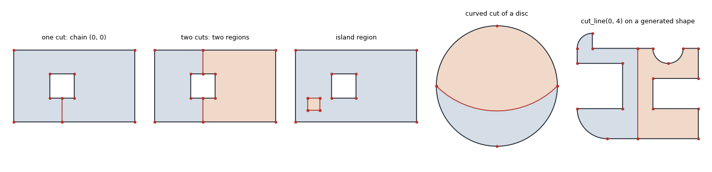

## 7. Smooth curves and airfoils

A spline edge is the interpolating cubic spline (chord-length parameterized)
through its start point, an `interior` list of points and its end point;
`angles` must be 0 for it. At a vertex flagged `smooth` the two adjacent edges
share a tangent, so the joint is G1 and the vertex angle is 180. By convention
a spline edge should turn by at most about 90 degrees, like an arc
(`validate(g, strict=True)` enforces a limit of 100), so an airfoil has four
control points: trailing edge, upper surface at 30% chord, leading edge, lower
surface at 30% chord (almost all the turning happens around the nose).

```python
pts = geo2d.naca4("0012", n=80)                       # Selig order, sharp trailing edge exactly at (1, 0)
pts = geo2d.read_selig("e387.dat")                    # or any point file
main = geo2d.airfoil_loop(pts)                        # clockwise 4-edge spline loop (a body)
flap = geo2d.airfoil_loop(geo2d.naca4("2412", 60), chord=0.4, alpha_deg=25, position=(1.05, -0.08))
g = geo2d.fluid_domain(-1, -1.5, 3, 1.5, [main, flap])   # box minus bodies
geo2d.spline_loop(points, n_control=4)                # any closed smooth curve through points
```

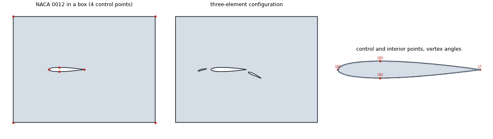

The feature-size descriptors are not adapted to sharp trailing edges yet
(`f_min` becomes tiny), so fluid domains are outside the `ratio` guarantee.
Splines appear in the Gmsh export as `Spline` curves through the interior
points and in DXF as fine polylines.

## 8. Saving, loading, exporting

```python
g.save("shape.json"); g = geo2d.Geometry.load("shape.json")
geo2d.save_jsonl(geoms, "shapes.jsonl"); geoms = geo2d.load_jsonl("shapes.jsonl")
geo2d.save_geo(g, "shape.geo", lc=1.0, recombine=True)   # Gmsh: Points, Lines, Circle arcs, Plane Surface, Physical groups
geo2d.save_dxf(g, "shape.dxf")                            # LWPOLYLINE with bulges
geo2d.validate(g, min_feature=1.0)                        # [] when valid
g.normalized()                                            # unit bounding box instead of lattice units
g.meta["program"]                                         # the operations that produced the shape
```

Command line:

```
python -m geogen.geo2d generate --n 100 --seed 0 --preset medium --out shapes.jsonl --gallery shapes.png
python -m geogen.geo2d generate --n 50 --set ratio=16 n_holes=[1,4] symmetry='"x"' --out big.jsonl
python -m geogen.geo2d gallery shapes.jsonl --out gallery.png --tags --points
python -m geogen.geo2d export shapes.jsonl --fmt geo --outdir geo --lc 1 --recombine
python -m geogen.geo2d info shapes.jsonl
```

## 9. Geometry format

A `Geometry` is a list of loops plus metadata. Loop 0 is the outer boundary
(counter-clockwise), loops 1.. are holes (clockwise): material is always on the
left of every edge.

Each loop has `points` (n × 2), `angles` (n), optional `tags` (n), optional
`interior` (n entries, `null` or a list of points), optional `smooth` (n
booleans, per vertex) and optional `region` (n integers, the region on the
material side of each edge). A geometry may also carry `chains`: open curves
with the same fields (n − 1 edges) plus `regions = [left, right]`. Edge `i` runs from `points[i]` to `points[(i+1) % n]`.
`angles[i]` is the signed included angle in degrees of that edge: 0 = straight,
otherwise a circular arc turning counter-clockwise (positive) or clockwise
(negative) from start to end. Arcs are at most 90 degrees, so a circle is a
square with four ±90 edges. An edge with `interior` points (and angle 0) is a
cubic spline through them. The chord polygon alone carries the topology; arcs
and splines refine it.

Arc geometry from the end points p0, p1 and angle θ (chord c = |p1 − p0|,
midpoint m, left unit normal nL of the chord):

    r = c / (2 sin(|θ|/2)),   C = m + (c/2) cot(θ/2) nL,   DXF bulge = tan(θ/4)

JSON (one object per geometry; JSON-lines for collections):

```json
{"loops": [{"points": [[0,0],[12,0],[12,6],[0,6]], "angles": [0,0,0,0],
            "tags": ["outer","outer","outer","outer"], "vertex_angles": [90,90,90,90]},
           {"points": [[4,3],[3,2],[2,3],[3,4]], "angles": [-90,-90,-90,-90],
            "tags": ["hole","hole","hole","hole"], "vertex_angles": [180,180,180,180]}],
 "meta": {"seed": 7, "params": {...}, "lattice": [12, 6], "symmetry": ["x"],
          "program": [{"op": "base", ...}, {"op": "cut", ...}, {"op": "corner", "kind": "fillet", "k": 1, ...}],
          "descriptors": {"f_min": 1.0, "ratio_bbox": 12.0, "n_holes": 1, ...}}}
```

Generated shapes have integer coordinates on the generator lattice, where 1
unit is the smallest feature; airfoils and other splines use real coordinates.
`vertex_angles` is derived and is ignored when loading.

## 10. Guarantees and descriptors

Every generated shape passes `geo2d.validate(g, min_feature=1.0)`: one
counter-clockwise outer loop, clockwise holes strictly inside it, no touching
or crossing edges, and smallest feature ≥ 1 lattice unit where the smallest
feature is min(shortest straight edge, smallest arc radius, smallest distance
between non-adjacent boundary edges). Consequently `ratio_bbox` ≤ `ratio`.

`meta["descriptors"]` (also `geo2d.describe(g)`) contains bbox, area fraction,
counts of holes / corners / arcs / concave and acute corners, `f_min`,
`ratio_bbox`, `ratio_edge`, histograms of interior angles (multiples of 45°;
180 = smooth joint) and arc angles, and mirror-symmetry flags.
